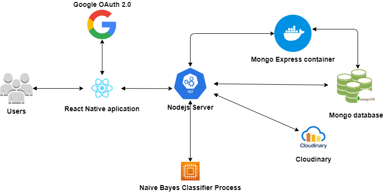
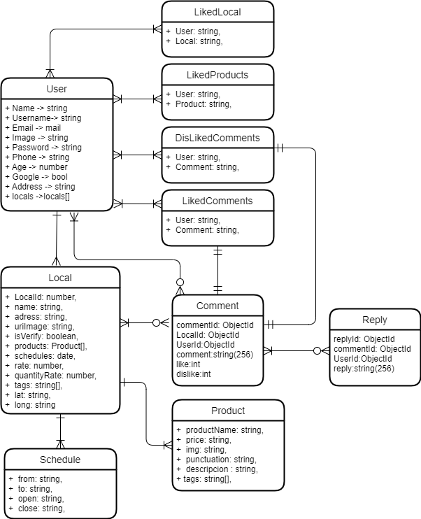

# Located.API

This repo contains all the endpoints to located using a node js Express server, we are using a kind of monolithic server to handle all the requests that the React native client needs

# Http response codes

| Code | Meaning               | Description                                                                           |
| ---- | --------------------- | ------------------------------------------------------------------------------------- |
| 200  | OK                    | The request has been successful.                                                      |
| 201  | Created               | The request has been fulfilled, and a new resource has been created.                  |
| 204  | No Content            | The server has successfully processed the request, but there is no content to return. |
| 301  | Moved Permanently     | The requested resource has been permanently moved to a new location.                  |
| 304  | Not Modified          | The resource has not been modified since the last request.                            |
| 400  | Bad Request           | The server cannot process the request due to a client error.                          |
| 401  | Unauthorized          | The client must authenticate to get the requested response.                           |
| 403  | Forbidden             | The client does not have permission to access the requested resource.                 |
| 404  | Not Found             | The requested resource could not be found.                                            |
| 500  | Internal Server Error | An internal server error has occurred.                                                |
| 503  | Service Unavailable   | The server is temporarily unable to handle the request.                               |

# Ports of the projects

| Port  | Project                          | Service        |
| ----- | -------------------------------- | -------------- |
| 8080  | Located.Api                      | Node Js Server |
| 8081  | Mongo manager(in docker compose) | Mongo express  |
| 27017 | Mongo db (in docker compose)     | MongodB        |
| 8082  | Located                          | Metro          |

# Architecture and interaction of all components

## Description of all components

- `Google OAuth 2.0`: This component allow Sing up and sing in to the users of a easy way, by using the google OAuth API we get access to the basic information of the user, that is profile picture, email, name and last name, all this using the standard JWT that allow us share encrypted information between components.
- `React Native Application`: This the client side component that consume all the services.
- `NodeJs Express Server`: All the end points(Users, locals, products, etc.)are contained here by using a docker image
- `Naive Bayes Classifier`: this process is inside the NodeJs server, and allow the server do the training process to tag the comments
  as positive, negative or neutral.
- `Mongo Express Container`: this is just a local tool to tests and see the data of a easy way, (_just for testing proposes_).
- `Cloudinary`: This is an external service that allows us to save the images that the user uploads.
- `MongoDb`: In a local environment we use a mongo db docker image but in a released environment we use a cluster of Mongo Atlas

# Diagram E/R of the database

**_This diagram is just representative, since we are using mongo db that is a non-relational database to store all the data_**

